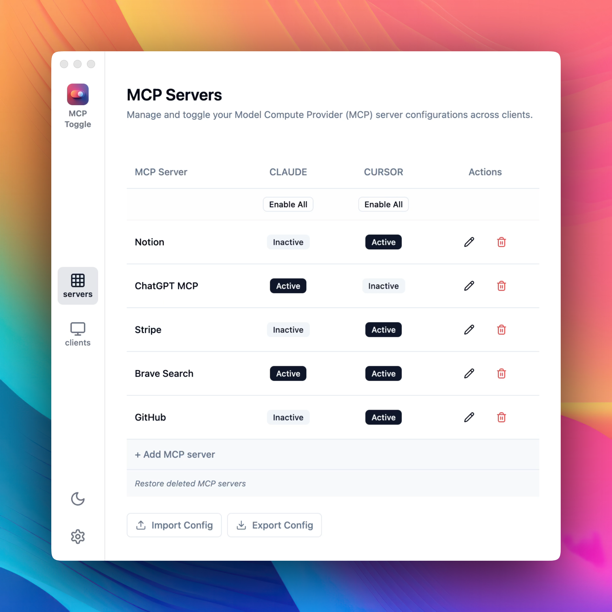

# MCP Server Manager

A simple utility for managing MCP server configurations across MCP client applications.

### Key Features

- **Unified Management**: Control all your MCP servers from a single interface
- **One-Click Activation**: Enable or disable MCPs for Claude or Cursor with simple toggles
- **Auto-Discovery**: Automatically imports existing MCP configurations
- **Ease of Use**: Clean, intuitive interface designed for productivity

## Download

[Download MCP Server Manager](https://www.mindfulapps.xyz/mcp?utm_source=github&utm_medium=referral&utm_campaign=github_mcp) from our website.

## How It Works

1. Add any client by specifying the JSON path to its config.
2. Add new server configurations directly through the form without manual JSON edits.
3. Enable or disable MCPs for each application with one click.
4. Export and import MCP configs to test and switch setups effortlessly.

## Issues and Feature Requests

This repository is used to track issues and feature requests for MCP Server Manager.

- [Report a Bug / Request a Feature](https://github.com/gabrielbacha/MCP-Manager-GUI/issues/new)

## Privacy

MCP Server Manager is a local utility that runs entirely on your machine. It does not collect any data or communicate with any external servers.

---

[Website](https://www.mindfulapps.xyz/?utm_source=github&utm_medium=referral&utm_campaign=github_mcp) | [Documentation](https://www.mindfulapps.xyz/mcp?utm_source=github&utm_medium=referral&utm_campaign=github_mcp) | [Support](mailto:support@mindfulapps.xyz)
